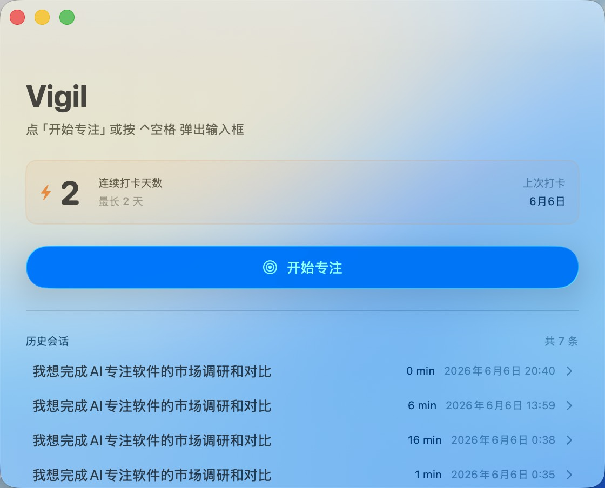
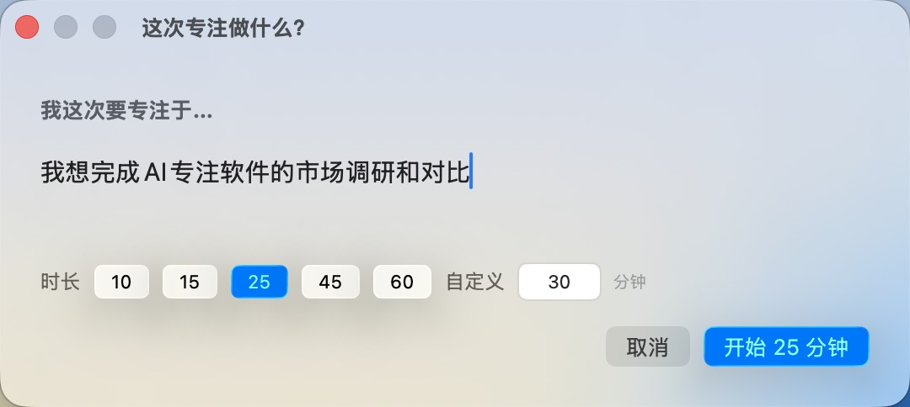
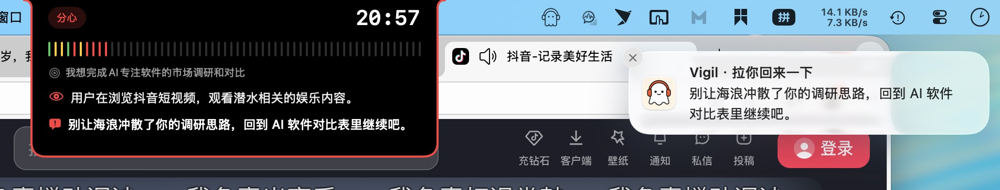
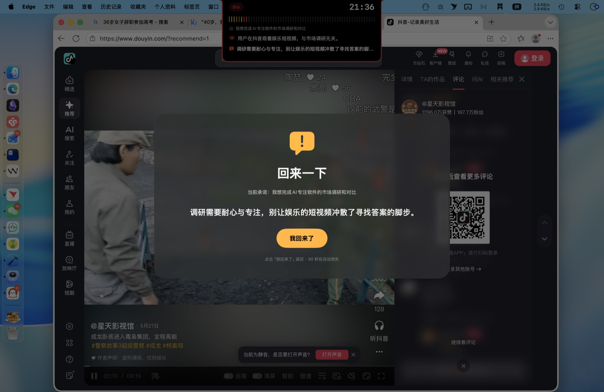
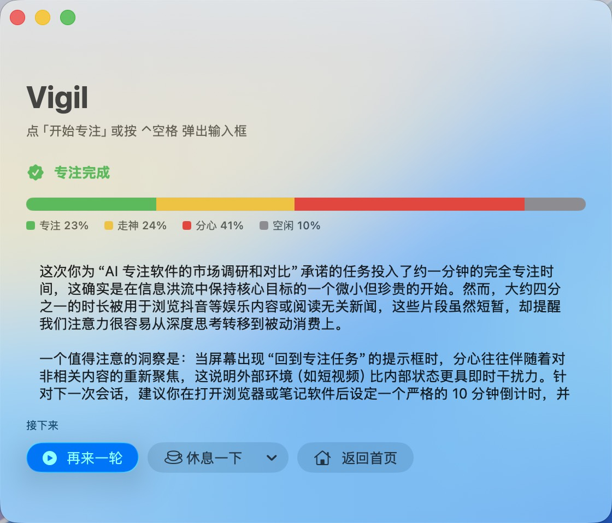
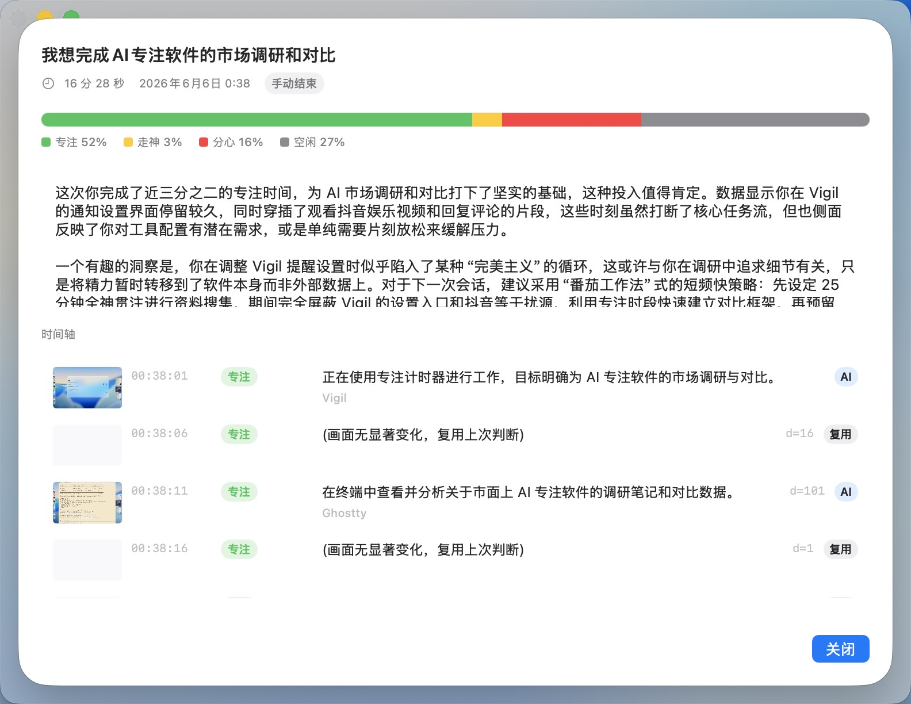

<div align="center">


# Vigil

**让AI帮你专注吧！**

实时分析屏幕，走神就把你拉回

[](https://github.com/ccmilu/Vigil/releases)
[](https://github.com/ccmilu/Vigil/releases)
[](https://www.swift.org/)
[](LICENSE)
[](https://github.com/ccmilu/Vigil/stargazers)

</div>

---

<p align="center">
  <video src="https://github.com/ccmilu/Vigil/releases/download/v0.1.0-media/6.6.2.mp4" controls width="720"></video>
</p>

<p align="center">
  写一句承诺 → AI 全程看着 → 走神拉你回来 → 结束 AI 复盘
</p>

## 为什么是 Vigil

- **注重隐私** —— Vigil 本身不收集任何数据。你也可以连接电脑本地运行的 AI 模型（如 LM Studio / Ollama），让屏幕画面完全不离开本机。
- **AI 实时分析屏幕** —— 你一跑去刷手机、打开抖音小红书摸鱼，马上就有反应。
- **提醒分轻重，不打扰心流** —— AI 把你的状态分成 4 档，每档对应不同力度的提醒：
  - **专注**：无任何提醒，安静陪着你
  - **走神**（持续）：灵动岛展开轻提示，无声音、无遮罩
  - **分心**：灵动岛展开 + 系统通知 + 全屏遮罩三路同时上；持续分心则每隔一段时间再弹一次
  - **闲置**（人不在电脑前）：灵动岛展开 + 声音反复提示，直到你回到电脑动鼠标或键盘
  
  所有提醒都可以在设置里调整。
- **每次结束都有反思** —— AI 会告诉你这次专注了多久、走神去哪了，让你看清自己的注意力到底用在哪。
- **原生 macOS 体验** —— 液态玻璃主窗口、灵动岛、菜单栏常驻图标、全局快捷键，和系统融为一体。

## 演示截图

<table>
  <tr>
    <td align="center" width="50%"><b>主窗口 + 历史记录</b><br/></td>
    <td align="center" width="50%"><b>写一句承诺，选时长</b><br/></td>
  </tr>
  <tr>
    <td align="center" colspan="2"><b>分心时，灵动岛提醒 + 系统通知第一时间提醒</b><br/></td>
  </tr>
  <tr>
    <td align="center" colspan="2"><b>分心时，全屏遮罩 + 灵动岛提醒</b><br/></td>
  </tr>
  <tr>
    <td align="center" width="50%"><b>会话结束 · AI 复盘</b><br/></td>
    <td align="center" width="50%"><b>历史详情 · 时间轴 + 每帧截图</b><br/></td>
  </tr>
</table>

## 与普通专注 App 的区别

| 能力 | 普通专注 App | Vigil |
|---|:---:|:---:|
| 倒计时 + AI复盘 | ❌ | ✅ |
| **AI 实时分析屏幕判断你是否专注** | ❌ | ✅ |
| **本地模型 (LM Studio / Ollama)** | ❌ | ✅ |
| **接入任意 AI Provider** | ❌ | ✅ |
| 数据完全本地存储 | 因 App 而异 | ✅ |
| 价格 | 多数订阅制 | 免费开源 |

## 安装

### DMG 下载（推荐）

1. 到 [Releases](../../releases) 下载最新 `Vigil-x.x.x.dmg`
2. 双击 DMG → 把 Vigil 拖进 Applications 文件夹
3. 首次启动若被系统阻止：系统设置 → 隐私与安全 → 在「已阻止 Vigil.app」处点「仍要打开」
4. 首启会请求 4 个权限：**屏幕录制 / 辅助功能 / 通知 / 钥匙串**，全部允许

### Homebrew Cask

计划中

## 配置 AI 服务

首次启动时，根据引导提示添加一个 Provider。常用配置：

| Provider | Base URL | API Key | Model |
|---|---|---|---|
| **LM Studio**（本地）| `http://127.0.0.1:1234/v1` | 你的本地 key| 加载的多模态模型 |
| **Ollama**（本地）| `http://127.0.0.1:11434/v1` | 你的本地 key | 加载的多模态模型 |
| **OpenAI** | `https://api.openai.com/v1` | 你的 OpenAI key | `gpt-4o-mini`|

其他 OpenAI 兼容厂商（Kimi / Doubao / 智谱 / 阿里千问 / OpenRouter / SiliconFlow 等）同理：填写 Base URL + API key + 视觉模型。

## Roadmap （待定）

**v0.2**
- [ ] 周历热力图
- [ ] 截图自动清理
- [ ] Homebrew 安装支持

**v0.3+**
- [ ] 扩展更多 API 格式（如 Anthropic / Gemini 协议）
- [ ] App 白名单 / 黑名单
- [ ] 环境白噪音
- [ ] iCloud 同步
- [ ] 周报 / 月报导出

## FAQ

### 分心时提醒太频繁了，能不能调弱一点？

可以。所有提醒行为都可以在「设置 → 提醒」中调整。

### Vigil会收集我的数据吗？

Vigil 本身不会收集、上传你的任何数据。所有截图都保存在电脑本地，想让画面完全不离开本机，接入本地 AI 模型（如 LM Studio / Ollama）即可。

### macOS 13 / Intel Mac 能用吗？

需要 macOS 14 及以上。Intel Mac 理论上可以用，但未做兼容测试。

### 为什么叫 Vigil？

Vigil 是英文里的「守夜人」—— 当所有人睡去，他独自醒着守望。让 AI 当你专注时的那个守夜人。

## 项目结构

```
Vigil/
├── App/                @main 入口、entitlements
├── Sources/
│   ├── AI/             AI 服务抽象与实现
│   ├── Capture/        截屏 + dHash + 系统检测
│   ├── Session/        会话状态机、灵动岛、菜单栏
│   ├── UI/             SwiftUI 视图
│   ├── Settings/       Provider / Keychain / @AppStorage
│   ├── Persistence/    SwiftData @Model + Migrations
│   └── Config/         Demo / Local 配置占位
└── Tests/              单元测试 + 集成测试
```

## 反馈

- Bug 报告 / 功能建议：[New Issue](../../issues/new)
- 邮件联系：[ccmilu@outlook.com](mailto:ccmilu@outlook.com)
- 喜欢这个项目？给个 Star 是最大鼓励

## License

[GPL-3.0](LICENSE) © 2026 Jason
